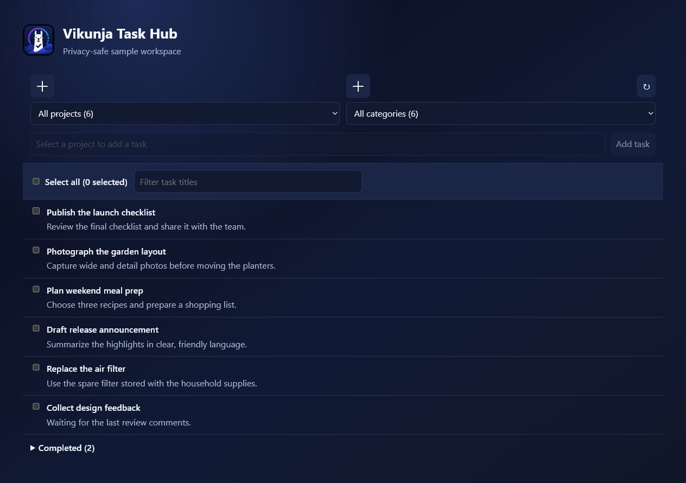
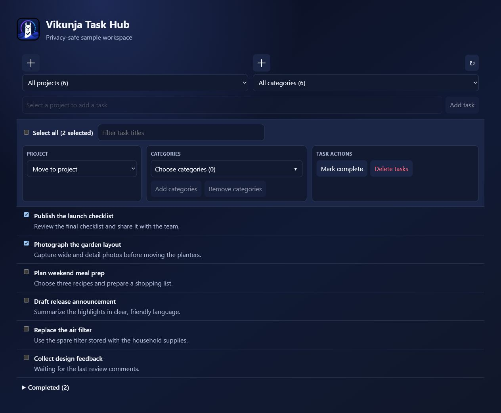
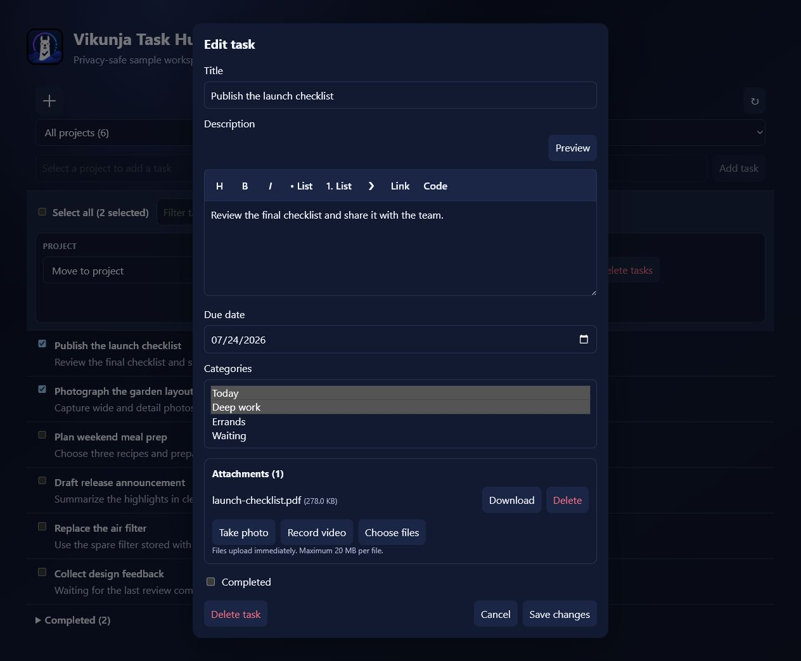

# Vikunja Task Hub

<p align="center">
  <a href="https://buymeacoffee.com/tednv"></a>
</p>


Vikunja Task Hub is a community Home Assistant integration and dashboard card for managing a Vikunja workspace without turning projects and tasks into Home Assistant devices or entities.

It provides one direct, responsive interface for projects, categories, active and completed tasks, bulk actions, rich task details, and attachments.

> [!IMPORTANT]
> This project is not affiliated with or endorsed by Vikunja or the Home Assistant project.

## See it in action



The card automatically discovers the projects and tasks available to the configured Vikunja token. Switch projects or categories from the counted selectors, search titles instantly, and keep completed work available without letting it clutter the active list.

### Organize many tasks at once



Task checkboxes are for real multi-selection—not an overloaded completion control. Select any combination of tasks, then move them to another project, add or remove categories, mark them complete or active, or delete them with confirmation.

### Rich task details and attachments



Open any task for a focused editor with Markdown formatting and preview, due dates, multiple categories, completion state, attachment management, and direct photo or video capture on supported devices.

> The screenshots use a generated sample workspace. They contain no private Home Assistant or Vikunja data.

## Features

### Projects and categories

- Automatically discover every project and task accessible to the configured Vikunja API token.
- Use a combined **All projects** view or return to the last project selected on that card.
- See active-task counts beside project and category names.
- Filter a project—or the combined workspace—by category or uncategorised tasks.
- Create projects and categories directly from the dashboard.
- Delete projects and categories with confirmations, impact counts, and explicit task-preservation choices.
- Keep task objects in Vikunja instead of creating ephemeral Home Assistant devices and entities.

### Daily task management

- Add tasks without leaving the dashboard.
- Search task titles as you type without interrupting keyboard focus.
- Sort newest tasks first and keep completed tasks in a separate collapsible section.
- Open any task to edit its title, description, due date, categories, and completion state.
- Write Markdown descriptions with shortcuts for headings, emphasis, lists, quotes, links, and inline code.
- Preview formatted descriptions before saving.
- Complete, reactivate, move, or permanently delete tasks.

### Bulk organization

- Select visible tasks individually or use **Select all** with a live selected count.
- Move selected tasks to another project.
- Add or remove multiple categories across the selection.
- Show **Mark complete** or **Mark active** only when the selected tasks make that action relevant.
- Confirm bulk deletion before anything is permanently removed.
- Combine project, category, and title filters to target exactly the tasks you want.

### Files and device capture

- Upload one or more files to a task through Home Assistant's authenticated connection.
- Download or delete existing task attachments.
- Take a photo or record a video directly when the device and browser support native capture.
- Keep the Vikunja API token out of frontend code while Home Assistant proxies attachment operations.
- Enforce a documented 20 MB per-file limit for the current websocket transport.

### Home Assistant experience

- Fill the available dashboard width and adapt the controls for narrower screens.
- Register the versioned custom-card resource automatically for storage-mode Lovelace dashboards.
- Support multiple Vikunja connections through an optional config-entry ID.
- Remember selections independently with an optional per-card `storage_key`.
- Respect Vikunja token permissions as the authorization boundary.

## Requirements

- Home Assistant with support for custom integrations and dashboard resources.
- A reachable Vikunja instance with API v1 enabled.
- A Vikunja API token with the permissions required for the actions you intend to use.
- HTTPS when browser camera capture or other secure-context browser features are required.

The current release is developed and tested against Home Assistant 2026.7 and `pyvikunja` 0.23.

## Installation

### HACS custom repository

[](https://my.home-assistant.io/redirect/hacs_repository/?owner=tednv&repository=vikunja-task-hub&category=integration)

Select the button above to open this repository in HACS, then download **Vikunja Task Hub**. If the button cannot locate your Home Assistant instance, add the repository manually:

1. Open HACS.
2. Open **Custom repositories**.
3. Add `https://github.com/tednv/vikunja-task-hub` as an **Integration** repository.
4. Install **Vikunja Task Hub**.
5. Restart Home Assistant when HACS requests it.

After Home Assistant restarts, start configuration with this button:

[](https://my.home-assistant.io/redirect/config_flow_start/?domain=vikunja)

### Manual installation

1. Copy `custom_components/vikunja` into your Home Assistant configuration directory:

   ```text
   config/
   └── custom_components/
       └── vikunja/
   ```

2. Restart Home Assistant.

Do not install this project alongside another custom integration using the `vikunja` domain. Home Assistant can load only one integration for a domain.

## Vikunja API token

Create a dedicated token in Vikunja and grant only the capabilities you need. Read access to projects, tasks, and labels is required for normal display. Creating, updating, deleting, moving, labeling, and attaching files require the corresponding write permissions.

Avoid reusing an administrator token. Token permissions remain the primary authorization boundary: the card can access only the Vikunja data and operations allowed to that token.

## Home Assistant setup

1. Open **Settings → Devices & services**.
2. Select **Add integration**.
3. Search for **Vikunja Task Hub**.
4. Enter the base URL of the Vikunja instance and the dedicated API token.
5. Leave **Strict SSL** enabled unless the instance deliberately uses a certificate that Home Assistant cannot validate.

The integration does not create devices or entities. It registers the authenticated dashboard API and the custom card resource.

## Add the dashboard card

Add a manual card with this configuration:

```yaml
type: custom:vikunja-todo-card
```

For installations with more than one Vikunja connection, add the relevant config-entry ID:

```yaml
type: custom:vikunja-todo-card
entry_id: YOUR_CONFIG_ENTRY_ID
storage_key: optional-unique-card-key
```

`storage_key` controls where the card remembers its last selected project. It contains no token or task content.

## Project and category deletion

- Deleting a project can permanently delete its tasks or preserve them by moving them to a project named **Inbox**.
- Deleting a category can permanently delete affected tasks or preserve them in their current projects while removing that category relationship.
- Permanent task deletion is always opt-in and confirmed.
- Project and category creation/deletion require a Home Assistant administrator session. Vikunja token permissions still apply.

## Attachments and device capture

Task details support normal files, device-native photo capture, and device-native video capture. Browser and operating-system support determine whether **Take photo** and **Record video** open a camera directly or fall back to a media chooser.

Attachments are stored by Vikunja. Home Assistant proxies authenticated upload and download operations without exposing the Vikunja token to frontend code. The current websocket transport limits each file to 20 MB.

## Upgrading from the predecessor integration

This project retains the `vikunja` domain and migration logic for compatibility with existing configuration entries. Before changing repositories:

1. Back up Home Assistant.
2. Remove the predecessor repository from HACS without deleting the active configuration entry.
3. Install Vikunja Task Hub so it replaces `custom_components/vikunja`.
4. Restart Home Assistant.
5. Remove obsolete dashboard cards and add `custom:vikunja-todo-card`.

The former entity/device implementation is intentionally not included.

## Troubleshooting

### Card does not appear or changes look stale

Perform a cache-bypassing browser reload. The integration automatically registers a versioned JavaScript resource when Lovelace uses storage mode.

For YAML-managed resources, add the module manually:

```yaml
resources:
  - url: /vikunja-static/vikunja-todo-card.js
    type: module
```

### Projects or actions are missing

Verify the configured Vikunja token can read the project and has the required permission for the requested action.

### Camera capture opens a file chooser

Native capture behavior is controlled by the browser and device. Use HTTPS, allow camera access, and verify that the browser supports media capture inputs.

### Attachment upload fails

Confirm task attachments are enabled on the Vikunja server, the token can update the task, and the file is no larger than 20 MB.

## Security and privacy

See [SECURITY.md](SECURITY.md) for vulnerability reporting and [docs/PRIVACY.md](docs/PRIVACY.md) for the data-flow and privacy model.

Never include API tokens, private service URLs, task content, or Home Assistant diagnostics in public issues. Redact logs and screenshots before sharing them.

## Development

- [Architecture](docs/ARCHITECTURE.md)
- [Development and validation](docs/DEVELOPMENT.md)
- [Release process](docs/RELEASING.md)
- [Standalone repository setup](docs/REPOSITORY_SETUP.md)
- [Contributing](CONTRIBUTING.md)
- [Changelog](CHANGELOG.md)

## Attribution and license

Vikunja Task Hub began as a derivative of [`joeShuff/vikunja-homeassistant`](https://github.com/joeShuff/vikunja-homeassistant) and has since been substantially redesigned and expanded. See [NOTICE](NOTICE) for provenance and modification information.

The project remains licensed under the [GNU Affero General Public License v3.0](LICENSE).
