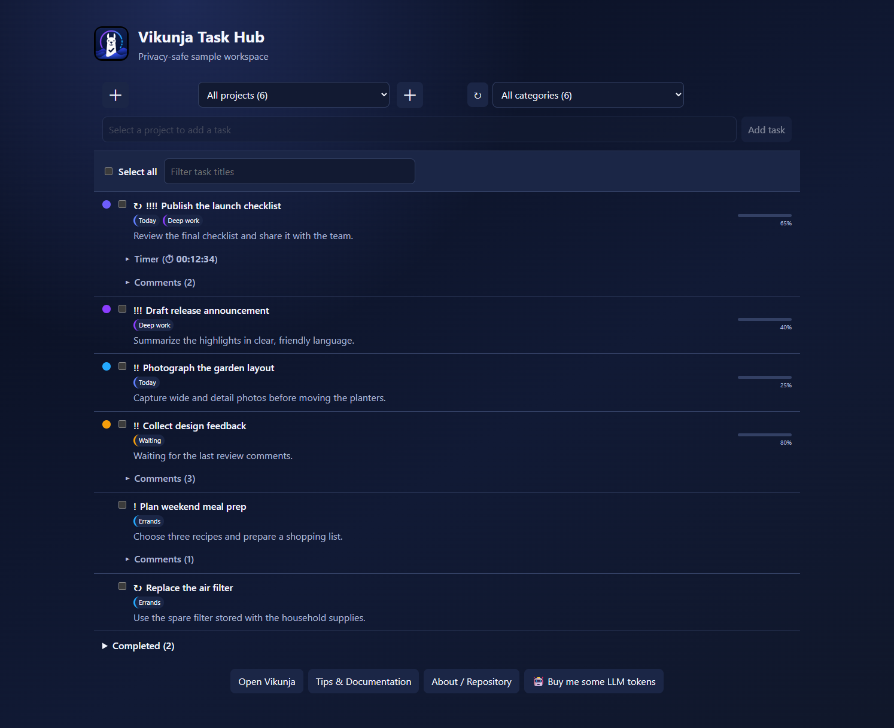
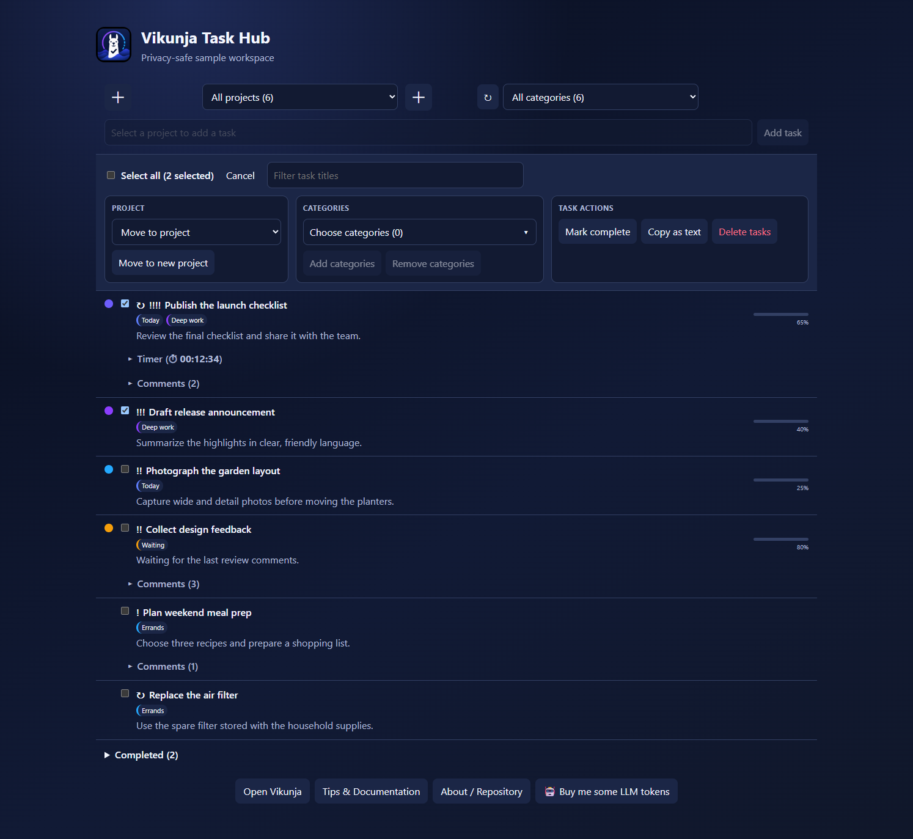
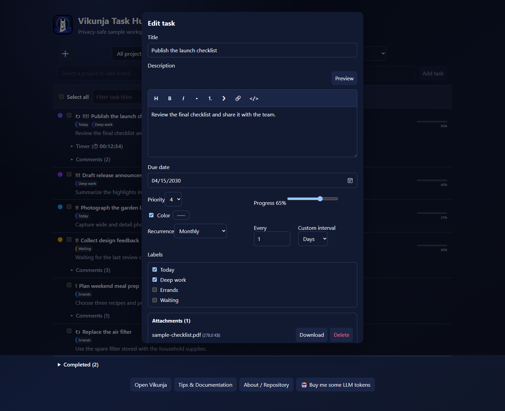
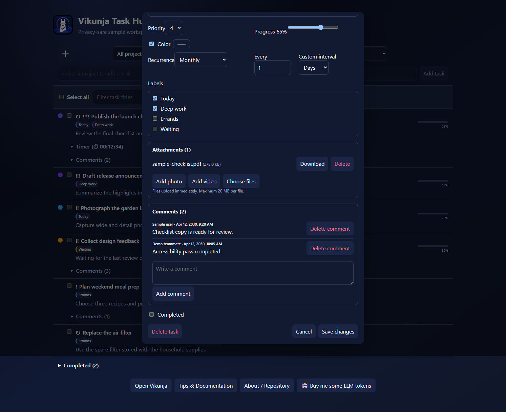
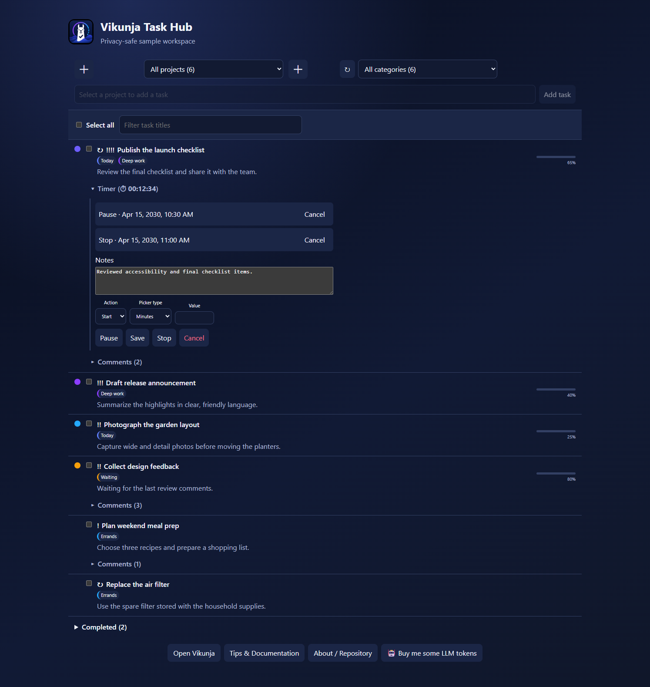

# Vikunja Task Hub

<p align="center">
  <a href="https://buymeacoffee.com/tednv"></a>
</p>


Vikunja Task Hub brings Vikunja project and task management into a polished Home Assistant dashboard experience.

Its responsive workspace brings together projects, categories, active and completed tasks, bulk organization, rich task details, and attachments.

> [!IMPORTANT]
> This independent community project was inspired by earlier Vikunja integrations for Home Assistant. It is not affiliated with or endorsed by Vikunja or the Home Assistant project.

## See it in action



The card automatically discovers the projects and tasks available to the configured Vikunja token. Switch projects or categories from the counted selectors, search titles instantly, and keep completed work available without letting it clutter the active list.

### Organize many tasks at once



Task checkboxes are for real multi-selection—not an overloaded completion control. Select any combination of tasks, then move them to an existing or newly named project, add or remove categories, mark them complete or active, or delete them with confirmation.

### Rich task details and recurring schedules



Open any task for a focused editor with Markdown formatting and preview, due dates, recurring schedules, multiple categories, completion state, attachment management, and direct photo or video capture on supported devices. Recurrence stays in the detailed editor, while a compact `↻` marker identifies repeating tasks in the main list.



Task details keep attachments and comments together. Add ordinary files or request device-native photo and video capture, then review timestamped comments, add a comment, or remove individual comments.

### Persistent timers and flexible scheduling



Add a paused timer from a task's right-click or long-press menu. Start and Pause act immediately; saved Start, Pause, or Stop actions can use minute, second, or exact timestamp scheduling. Home Assistant persists timers and executes scheduled actions without requiring the dashboard to remain open.

> The screenshots use a generated sample workspace. They contain no private Home Assistant or Vikunja data.

## Language support

Vikunja Task Hub follows the language selected in Home Assistant and falls back to English when a locale is not yet available. The setup and reconfiguration flow, card, detailed editor, confirmation dialogs, recurrence controls, and footer links include these translations:

- English (English)
- Spanish (Español)
- French (Français)
- German (Deutsch)
- Italian (Italiano)
- Greek (Ελληνικά)
- Serbian (Српски)
- Hungarian (Magyar)
- Romanian (Română)
- Irish (Gaeilge)
- Russian (Русский)
- Ukrainian (Українська)
- Polish (Polski)
- Dutch (Nederlands)
- Turkish (Türkçe)
- Persian (فارسی)
- Simplified Chinese (简体中文)
- Japanese (日本語)
- Korean (한국어)
- Hindi (हिन्दी)
- Bengali (বাংলা)
- Urdu (اردو)
- Arabic (العربية)
- Portuguese (Português)
- Indonesian (Bahasa Indonesia)
- Vietnamese (Tiếng Việt)
- Thai (ไทย)

## Features

### Projects and categories

- Automatically discover every project and task accessible to the configured Vikunja API token.
- Use a combined **All projects** view or return to the last project selected on that card.
- See active-task counts beside project and category names.
- Filter a project—or the combined workspace—by category or uncategorised tasks.
- Create projects and categories directly from the dashboard.
- Delete projects and categories with confirmations, impact counts, and explicit task-preservation choices.
- Manage Vikunja projects, categories, tasks, and attachments through one focused dashboard workspace.

### Daily task management

- Add tasks without leaving the dashboard.
- Search task titles as you type without interrupting keyboard focus.
- Sort higher-priority tasks first, then newest first within the same priority, and keep completed tasks in a separate collapsible section.
- Open any task to edit its title, description, due date, labels, priority, progress, color, recurrence, and completion state.
- Write Markdown descriptions with shortcuts for headings, emphasis, lists, quotes, links, and inline code.
- Preview formatted descriptions before saving.
- Complete, reactivate, move, or permanently delete tasks.
- Right-click or long-press a task for quick completion, priority, copy, share, and delete actions. Sharing uses the device's native share sheet when available and falls back to the clipboard.
- Expand comments only on tasks that have them, without loading comment bodies into the main task request.
- Open a bundled, language-matched Tips & Documentation guide from the card footer for plain-language guidance and quick references covering task editing, selection, bulk actions, comments, attachments, indicators, and timers.
- Track time independently on each task with restart-safe **Start**, **Pause**, **Stop**, and **Cancel** controls. Optional notes persist with the timer and are included with the duration and date in the removable completion comment.
- Add a paused stopwatch through right-click or long press, then use its collapsible **Timer** section for elapsed time, notes, saved actions, and all session controls. Server-side schedules persist without an open browser.
- Use **Start** and **Pause** for immediate control. Build any number of future Start, Pause, or Stop actions by selecting Minutes, Seconds, or an exact Timestamp and pressing **Save**.
- Review saved actions above Notes and cancel each one independently. Stop writes the normal dated duration-and-Notes comment; timer **Cancel** still removes the full timer after confirmation.
- See task-color dots, label chips, priority markers, and compact progress bars directly in the list.
- Open the selected project directly in Vikunja from the card footer.

### Recurring tasks

- Set daily, weekly, monthly, or custom hour/day/week intervals in the detailed task editor.
- Repeat from the scheduled date or from the date the task is completed.
- Recognize recurring tasks from the compact `↻` marker before their titles.
- Clear a recurring schedule without changing the rest of the task.

### Bulk organization

- Select visible tasks individually or use **Select all**; the selected count appears only when at least one task is selected.
- Move selected tasks to an existing project or create, move into, and select a newly named project in one action.
- Add or remove multiple categories across the selection.
- Show **Mark complete** or **Mark active** only when the selected tasks make that action relevant.
- Confirm bulk deletion before anything is permanently removed.
- Combine project, category, and title filters to target exactly the tasks you want.

### Files and device capture

- Upload one or more files to a task through Home Assistant's authenticated connection.
- Download or delete existing task attachments.
- Use **Add photo** or **Add video** to request device capture when the browser supports HTML media-capture inputs, with a media chooser as the browser-controlled fallback.
- Keep the Vikunja API token out of frontend code while Home Assistant proxies attachment operations.
- Enforce a documented 20 MB per-file limit for the current websocket transport.

### Home Assistant experience

- Fill the available dashboard width and adapt the controls for narrower screens.
- Register the versioned custom-card resource automatically for storage-mode Lovelace dashboards.
- Support multiple Vikunja connections through an optional config-entry ID.
- Remember selections independently with an optional per-card `storage_key`.
- Respect Vikunja token permissions as the authorization boundary.
- Open the connected Vikunja web interface from a safe, independently loaded footer link.
- Configure daily, weekly, monthly, or custom task recurrence in the detailed editor and identify recurring tasks at a glance.

## Requirements

- Home Assistant with support for custom integrations and dashboard resources.
- A reachable Vikunja instance with API v1 enabled.
- A Vikunja API token with the permissions required for the actions you intend to use.
- A browser and device that support HTML media-capture inputs for direct camera capture; other environments can use the normal media chooser.

The current release is developed and tested against Home Assistant 2026.7 and `pyvikunja` 0.23.

## Installation

### HACS custom repository

[](https://my.home-assistant.io/redirect/hacs_repository/?owner=tednv&repository=vikunja-task-hub&category=integration)

Select the button above to open this repository in HACS, then download **Vikunja Task Hub**. If the button cannot locate your Home Assistant instance, add the repository manually:

1. Open HACS.
2. Open **Custom repositories**.
3. Add `https://github.com/tednv/vikunja-task-hub` as an **Integration** repository.
4. Install **Vikunja Task Hub**.
5. Restart Home Assistant when HACS requests it.

After Home Assistant restarts, start configuration with this button:

[](https://my.home-assistant.io/redirect/config_flow_start/?domain=vikunja)

### Manual installation

1. Copy `custom_components/vikunja` into your Home Assistant configuration directory:

   ```text
   config/
   └── custom_components/
       └── vikunja/
   ```

2. Restart Home Assistant.

Do not install this project alongside another custom integration using the `vikunja` domain. Home Assistant can load only one integration for a domain.

## Vikunja API token

Create a dedicated token in Vikunja and grant only the capabilities you need. Read access to projects, tasks, labels, and comments is required for normal display. Creating, updating, deleting, moving, labeling, and attaching files require the corresponding write permissions.

Avoid reusing an administrator token. Token permissions remain the primary authorization boundary: the card can access only the Vikunja data and operations allowed to that token.

## Home Assistant setup

1. Open **Settings → Devices & services**.
2. Select **Add integration**.
3. Search for **Vikunja Task Hub**.
4. Enter the base URL of the Vikunja instance and the dedicated API token.
5. Leave **Strict SSL** enabled unless the instance deliberately uses a certificate that Home Assistant cannot validate.

The integration registers an authenticated dashboard API and the custom card resource, while Vikunja remains the source of truth for project and task data.

## Add the dashboard card

For a full-width Sections dashboard view, use this configuration:

```yaml
type: sections
max_columns: 4
title: Vikunja
path: vikunja
sections:
  - type: grid
    cards:
      - type: custom:vikunja-todo-card
        title: Tasks
        column_span: 4
    column_span: 4
```

If the view already exists, add a manual card with this minimal configuration:

```yaml
type: custom:vikunja-todo-card
```

For installations with more than one Vikunja connection, add the relevant config-entry ID:

```yaml
type: custom:vikunja-todo-card
entry_id: YOUR_CONFIG_ENTRY_ID
storage_key: optional-unique-card-key
```

`storage_key` controls where the card remembers its last selected project. It contains no token or task content.

## Project and category deletion

- **Inbox** is Vikunja's default task project and cannot be deleted from the card.
- Deleting a project can permanently delete its tasks or preserve them by moving them to a project named **Inbox**.
- Deleting a category can permanently delete affected tasks or preserve them in their current projects while removing that category relationship.
- Permanent task deletion is always opt-in and confirmed.
- Project and category creation/deletion require a Home Assistant administrator session. Vikunja token permissions still apply.

## Attachments and device capture

Task details support normal files plus photo and video inputs that request the device's outward-facing camera. Browser and operating-system support determine whether **Add photo** and **Add video** open capture directly or use a media chooser. The card supplies the standard HTML capture hint; the browser makes the final choice.

Attachments are stored by Vikunja. Home Assistant proxies authenticated upload and download operations without exposing the Vikunja token to frontend code. The current websocket transport limits each file to 20 MB.

## Upgrading from an earlier Vikunja integration

This project retains the `vikunja` domain and migration logic for compatibility with existing configuration entries. Before changing repositories:

1. Back up Home Assistant.
2. Remove the earlier repository from HACS without deleting the active configuration entry.
3. Install Vikunja Task Hub so it replaces `custom_components/vikunja`.
4. Restart Home Assistant.
5. Remove obsolete dashboard cards and add `custom:vikunja-todo-card`.

The existing configuration entry can continue to provide the connection while the new dashboard card becomes the primary workspace.

## Troubleshooting

### Card does not appear or changes look stale

Perform a cache-bypassing browser reload. The integration automatically registers a versioned JavaScript resource when Lovelace uses storage mode.

For YAML-managed resources, add the module manually:

```yaml
resources:
  - url: /vikunja-static/vikunja-todo-card.js
    type: module
```

### Projects or actions are missing

Verify the configured Vikunja token can read the project and has the required permission for the requested action.

### Camera capture opens a file chooser

Native capture behavior is controlled by the browser and device. Verify that the browser supports HTML media-capture inputs and permit camera access if prompted. Some browsers ignore the capture hint and use a media chooser; HTTPS alone does not guarantee direct camera launch.

### Attachment upload fails

Confirm task attachments are enabled on the Vikunja server, the token can update the task, and the file is no larger than 20 MB.

## Security and privacy

See [SECURITY.md](SECURITY.md) for vulnerability reporting and [docs/PRIVACY.md](docs/PRIVACY.md) for the data-flow and privacy model.

Never include API tokens, private service URLs, task content, or Home Assistant diagnostics in public issues. Redact logs and screenshots before sharing them.

## Roadmap

- Add project renaming with the same administrator and confirmation safeguards used for project management.
- Add a preferences page for customizing task sort order.
- Add subtasks for breaking larger work into independently trackable steps.
- Add task reminders while continuing to use Vikunja as the scheduling source of truth.
- Add task relations for blocking, related, and cross-project task links.
- Expand visual customization while continuing to inherit Home Assistant theme colors by default.
- Evaluate a dedicated mobile-focused card or layout for workflows that cannot be served well by the responsive workspace.

Additional roadmap ideas will be discussed before they are added here.

## Development

- [Architecture](docs/ARCHITECTURE.md)
- [Development and validation](docs/DEVELOPMENT.md)
- [Release process](docs/RELEASING.md)
- [Repository settings](docs/REPOSITORY_SETUP.md)
- [Contributing](CONTRIBUTING.md)
- [Changelog](CHANGELOG.md)

## Attribution and license

Vikunja Task Hub builds on the foundation established by [`joeShuff/vikunja-homeassistant`](https://github.com/joeShuff/vikunja-homeassistant) and gratefully acknowledges that work. See [NOTICE](NOTICE) for detailed provenance and modification information.

The project remains licensed under the [GNU Affero General Public License v3.0](LICENSE).
