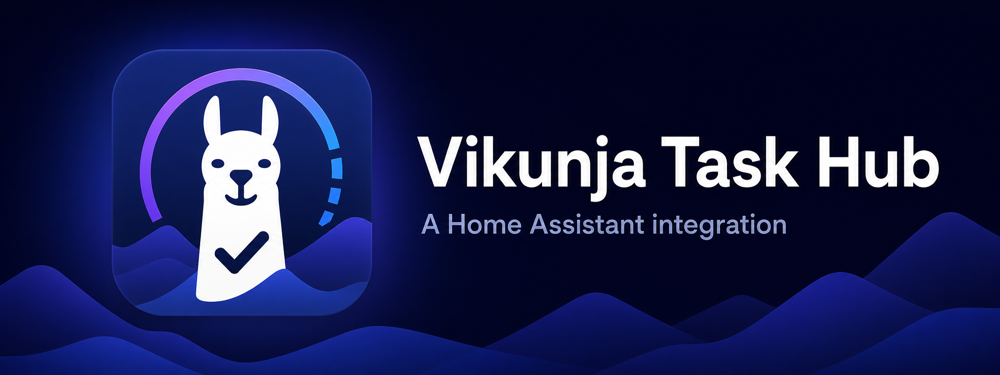

# Vikunja Task Hub



Vikunja Task Hub is a community Home Assistant integration and dashboard card for managing a Vikunja workspace without turning projects and tasks into Home Assistant devices or entities.

It provides one direct, responsive interface for projects, categories, active and completed tasks, bulk actions, rich task details, and attachments.

> [!IMPORTANT]
> This project is not affiliated with or endorsed by Vikunja or the Home Assistant project.

## Highlights

- Browse every Vikunja project available to the configured API token.
- Remember the last selected project or use an aggregate **All projects** view.
- Filter by category and search task titles.
- Create, edit, complete, reactivate, move, and delete tasks.
- Select multiple tasks for project, category, status, or deletion actions.
- Create and safely delete projects and categories with impact counts and confirmation.
- Edit Markdown descriptions with formatting assistance and preview.
- Upload, download, and delete task attachments.
- Capture a photo or video directly on supported devices.
- Display completed tasks separately and sort newest tasks first.
- Avoid ephemeral Home Assistant devices and entities.

## Requirements

- Home Assistant with support for custom integrations and dashboard resources.
- A reachable Vikunja instance with API v1 enabled.
- A Vikunja API token with the permissions required for the actions you intend to use.
- HTTPS when browser camera capture or other secure-context browser features are required.

The current release is developed and tested against Home Assistant 2026.7 and `pyvikunja` 0.23.

## Installation

### HACS custom repository

[](https://my.home-assistant.io/redirect/hacs_repository/?owner=tednv&repository=vikunja-task-hub&category=integration)

Select the button above to open this repository in HACS, then download **Vikunja Task Hub**. If the button cannot locate your Home Assistant instance, add the repository manually:

1. Open HACS.
2. Open **Custom repositories**.
3. Add `https://github.com/tednv/vikunja-task-hub` as an **Integration** repository.
4. Install **Vikunja Task Hub**.
5. Restart Home Assistant when HACS requests it.

After Home Assistant restarts, start configuration with this button:

[](https://my.home-assistant.io/redirect/config_flow_start/?domain=vikunja)

### Manual installation

1. Copy `custom_components/vikunja` into your Home Assistant configuration directory:

   ```text
   config/
   └── custom_components/
       └── vikunja/
   ```

2. Restart Home Assistant.

Do not install this project alongside another custom integration using the `vikunja` domain. Home Assistant can load only one integration for a domain.

## Vikunja API token

Create a dedicated token in Vikunja and grant only the capabilities you need. Read access to projects, tasks, and labels is required for normal display. Creating, updating, deleting, moving, labeling, and attaching files require the corresponding write permissions.

Avoid reusing an administrator token. Token permissions remain the primary authorization boundary: the card can access only the Vikunja data and operations allowed to that token.

## Home Assistant setup

1. Open **Settings → Devices & services**.
2. Select **Add integration**.
3. Search for **Vikunja Task Hub**.
4. Enter the base URL of the Vikunja instance and the dedicated API token.
5. Leave **Strict SSL** enabled unless the instance deliberately uses a certificate that Home Assistant cannot validate.

The integration does not create devices or entities. It registers the authenticated dashboard API and the custom card resource.

## Add the dashboard card

Add a manual card with this configuration:

```yaml
type: custom:vikunja-todo-card
```

For installations with more than one Vikunja connection, add the relevant config-entry ID:

```yaml
type: custom:vikunja-todo-card
entry_id: YOUR_CONFIG_ENTRY_ID
storage_key: optional-unique-card-key
```

`storage_key` controls where the card remembers its last selected project. It contains no token or task content.

## Project and category deletion

- Deleting a project can permanently delete its tasks or preserve them by moving them to a project named **Inbox**.
- Deleting a category can permanently delete affected tasks or preserve them in their current projects while removing that category relationship.
- Permanent task deletion is always opt-in and confirmed.
- Project and category creation/deletion require a Home Assistant administrator session. Vikunja token permissions still apply.

## Attachments and device capture

Task details support normal files, device-native photo capture, and device-native video capture. Browser and operating-system support determine whether **Take photo** and **Record video** open a camera directly or fall back to a media chooser.

Attachments are stored by Vikunja. Home Assistant proxies authenticated upload and download operations without exposing the Vikunja token to frontend code. The current websocket transport limits each file to 20 MB.

## Upgrading from the predecessor integration

This project retains the `vikunja` domain and migration logic for compatibility with existing configuration entries. Before changing repositories:

1. Back up Home Assistant.
2. Remove the predecessor repository from HACS without deleting the active configuration entry.
3. Install Vikunja Task Hub so it replaces `custom_components/vikunja`.
4. Restart Home Assistant.
5. Remove obsolete dashboard cards and add `custom:vikunja-todo-card`.

The former entity/device implementation is intentionally not included.

## Troubleshooting

### Card does not appear or changes look stale

Perform a cache-bypassing browser reload. The integration automatically registers a versioned JavaScript resource when Lovelace uses storage mode.

For YAML-managed resources, add the module manually:

```yaml
resources:
  - url: /vikunja-static/vikunja-todo-card.js
    type: module
```

### Projects or actions are missing

Verify the configured Vikunja token can read the project and has the required permission for the requested action.

### Camera capture opens a file chooser

Native capture behavior is controlled by the browser and device. Use HTTPS, allow camera access, and verify that the browser supports media capture inputs.

### Attachment upload fails

Confirm task attachments are enabled on the Vikunja server, the token can update the task, and the file is no larger than 20 MB.

## Security and privacy

See [SECURITY.md](SECURITY.md) for vulnerability reporting and [docs/PRIVACY.md](docs/PRIVACY.md) for the data-flow and privacy model.

Never include API tokens, private service URLs, task content, or Home Assistant diagnostics in public issues. Redact logs and screenshots before sharing them.

## Development

- [Architecture](docs/ARCHITECTURE.md)
- [Development and validation](docs/DEVELOPMENT.md)
- [Release process](docs/RELEASING.md)
- [Standalone repository setup](docs/REPOSITORY_SETUP.md)
- [Contributing](CONTRIBUTING.md)
- [Changelog](CHANGELOG.md)

## Support the project

If Vikunja Task Hub is useful to you, you can support its continued development:

[](https://buymeacoffee.com/tednv)

## Attribution and license

Vikunja Task Hub began as a derivative of [`joeShuff/vikunja-homeassistant`](https://github.com/joeShuff/vikunja-homeassistant) and has since been substantially redesigned and expanded. See [NOTICE](NOTICE) for provenance and modification information.

The project remains licensed under the [GNU Affero General Public License v3.0](LICENSE).
